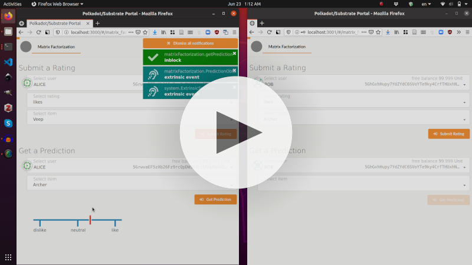

# Minimal Collaborative Filtering Implementation on a Blockchain

This repository contains an implementation of a custom blockchain that serves as a proof-of-concept for a novel kind of decentralized machine learning applications.
For more information, see the [website](https://robamler.github.io/blockchain-machine-learning-demo/).

## Demo

Click below to watch a screencast of a minimal demo:

[](https://robamler.github.io/blockchain-machine-learning-demo/)

## Installation

1. Clone the repository and its submodules:

    ```bash
    git clone --recursive git@github.com:robamler/blockchain-machine-learning-demo.git
    ```

    - If you forgot the `--recursive` switch, just `cd` in the directory and run `git submodule update --init`.

2. Set up rust and substrate:

    ```bash
    curl https://getsubstrate.io -sSf | bash -s -- --fast
    ```

    - For more information, see the [corresponding section of the "substrate recipes" tutorial](https://substrate.dev/recipes/1-prepare-kitchen/1-build-node.html).

3. Build the node (this will take a while):

    ```bash
    cd blockchain-machine-learning-demo/blockchain-node
    cargo build --release -p kitchen-node
    ```

    - Don't worry about the name "kitchen-node", this is just reminiscent of the [substrate recipe](https://substrate.dev/recipes/introduction.html) on which this custom blockchain implementation is based.

4. Start a node: from the `blockchain-node` directory, run

    ```bash
    ./target/release/kitchen-node --dev
    ```

5. Optional: start a second node (if you want to test two nodes communicating with each other).
    To do this, look for a log message saying "Local node identity is:" in the output of the above command and copy the ID that follows to the clipboard.
    Then, from the `blockchain-node` directory, run the following command, replacing `NODE1_IDENTITY` with the ID in your clipboard:

    ```bash
    ./target/release/kitchen-node --dev -d /tmp/node2 --ws-port 9945 --reserved-nodes /ip4/127.0.0.1/tcp/30333/p2p/NODE1_IDENTITY
    ```

    If the ID was correct, then the two running nodes should see each other, and they both should print "(1 peers)" to the command line every few seconds.

6. Start a user interface:

    ```bash
    cd ../ui/
    yarn run start
    ```

    Wait until you see an output similar to the following (this may take a few minutes):

    ```text
    [../../node_modules/html-webpack-plugin/lib/loader.js!./public/index.html] /home/robamler/Documents/projects/decentralized-matrix-factorization/src/ui/node_modules/html-webpack-plugin/lib/loader.js!./public/index.html 853 bytes {HtmlWebpackPlugin_0} [built]
    ```

    Then open http://localhost:3000 in your browser.
    If you see an error message "Not Found / 404" then the UI is still compiling.
    Wait until you see the above confirmation message and then reload the page.

7. Optional: if you started a second node in step 5 above, then you can connect a second UI to it.
    From the `ui` directory, run:

    ```bash
    yarn run start2
    ```

    Wait again until you see the above confirmation message, then open http://localhost:3001 in a new browser tab.

8. To connect a UI to a node, click on the circle in the upper left corner.
    A dialog saying "select network" should pop up.

    - To connect to the primary node you started in step 4 above, select "*Local Node (own, 127.0.0.1:9944)*".
    - To connect to the optional additional node from step 5 above, toggle the option "*custom endpoint*" and enter `ws://127.0.0.1:9945/`

    Click "Save & Reload".


9. In the left-hand pane of the UI, click on "Matrix Factorization" and enjoy playing with an overly simplistic recommendation system :)

10. If you want to delete the blockchain and start over:
    stop all running nodes (`Ctrl + C`); then, from the `blockchain-node` directory, run

    ```bash
    ./target/release/kitchen-node purge-chain --dev
    rm -rf /tmp/node2 # (only necessary if you executed the optimal step 5 above)
    ```

    Then restart the node(s) following step 4 (and optionally 5) above, and reload the UI(s).

## Copyright

[Robert Bamler](https://robamler.github.io)
